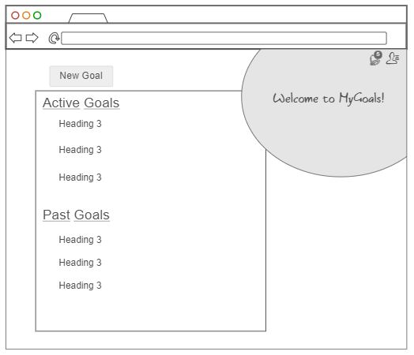
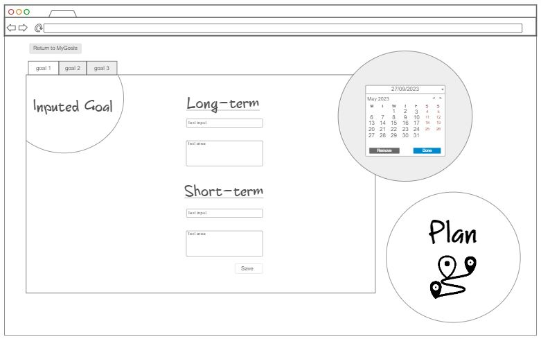
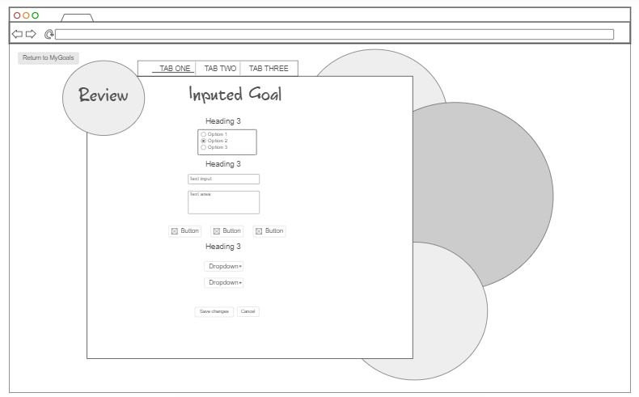

# startup
*startup application for CS 260*

## Specification Deliverable

## Elevator Pitch
Have you struggled making and setting goals? Do you struggle sticking to your plans and checking back on them? The MyGoals site helps you through the process of goalsetting to help you keep better track of your improvement. Whether it is coming up with good goals, making realistic plans for them, or looking back for ways to improve, this site is designed to see you through.

## Design
**MyGoals Home**

**Planning Stage**

**Reflecting Stage**

## Key Features
- Secure Login through https
- Discover new goals through games and questionaires
- Prioritize your ideas to choose and save them for later
- Take goals and establish firm plans through follow-up questions
- Set and edit reminders to their calendar
- Reflect on how goals went through self-evaluation surveys
- Celebrate your efforts through the achievements log

## Technologies
I will use each of these following technologies in my project.
- **HTML** - Provides the correct structre for the site. There will be 3-4 HTML pages. One for login, the home page, and others for the goal setting/making/reflecting.
- **CSS** - Applies the styling and design that will provide a good color, shape, and contrast to the page.
- **React** - Works the login, goal-setting games, display of goals, and interactive surveys.
- **Service** - Backend service for each of the following:
    - login credentials
    - saved user goals
- **DB/Login** - Registers login, and secures user goals and credentials
- **WebSocket** - Displays accomplished goals in the achievements log 

## HTML deliverable 🏠
Here is the required information for my Startup HTML

I created a foundation for my project, leaving connections to let CSS, JavaScript, and Websockets to build off of it.

To be more Specific:

- [x] **HTML pages** - I made 5 HTML pages - Login *(index.html)*, Home *(goals.html)*, Goalsetting *(plan.html)*, Brainstorming *(ideas.html)*, and Reviewing *(review.html)*.
- [x] **Links** - There is a nav bar to the Login and Home page on each page, the other three have various links in the Home page. There are also links to help the user through the goalsetting process.
- [x] **Text** - There is representational text given in place of goal names, descriptions, and dates. These will later be inputs from the user.
- [ ] **Images** - Other than the favicon, I didn't really have any reason to include images.
- [x] **DB/Login** - Input for name, email and password are set for login. The different goals/ideas given from the user will also be stored in the database.
- [x] **WebSocket** - There is an achievments log that will display when any user completes a given task (make goal, accomplish goal, etc).

*I also have comments within my code to help explain functions*

## CSS deliverable 🎨
Here is the required information for my Startup CSS

I took the time these last couple weeks to properly style the website to make it more appealing and understandable for the User.

Including the following elements:

- [x] **Header, footer, and main content body on each page**
- [x] **Navigation Elements** - I got rid of the rough html design elements to add color, design, and anchored functionality.
- [x] **Responsive Web Design** - The website has been designed to prioritize content based on whatever window design the User applies while still looking appealing.
- [x] **Application elements** - I implemented good contrast and use of whitespace.
- [x] **Application text content** - I used consistent fonts and color palette to tie everything together.
- [ ] **Application Images** - Other than the favicon used on the navbar on each page, I still don't have any images for my site.

*I also have comments within my code to help explain functions that don't appear due to lack of javascript*

## React deliverable 🛰️
Here is the information required for my React Startup

I used both JavaScript and React to create a nicer flow and functionallity throughout my website. There is also some placeholders for the use of a database and websockets later on.

This version includes the following:

- [x] **Bundled and Transpiled using Vite**
- [x] **Components** - Login, MyGoals and Idea-generater have mock-ups for lack of database and Websockets, but make use of local storage. 
- [x] **Login** - Brings you to MyGoals after logging in the user.
- [x] **Database** - User Goals and login authentication will be stored in the database. These are using local storage to function in the meantime.
- [x] **Websocket** - There is a setInterval function mimicking its use, but once implemented users will be able to recieve those instead.
- [x] **Application Logic** - Goal names and descriptions change with user selections. 
- [x] **Router** - There is routing through each of the pages for a fluid flow mainly in and out of the MyGoals page.
- [x] **Hooks** - UseState hooks are used for the storing & using of goals, detecting & publishing achievements, user authentication, and a confetti popup.

## Service 🛠️
This is the information required for my Startup Service

I used some backend endpoints to handle user authentication and also a little bit for goalsetting (setting up for when I have a database). I also used a 3rd party API quote service for this deliverable.

- [x] **Node.js/Express HTTP service**
- [x] **Static middleware for frontend**
- [x] **Calls to third party endpoints** - I found a free API that delivers modivational quotes for my goalsetting page.
- [x] **Backend service endpoints** - Placeholders for login that stores the current user on the server. Endpoints for goals.
- [x] **Frontend calls service endpoints** - I used fetch functions to call these services.

## DB/Login 👾
Here is my information reguarding my Database & Login deliverable

For this deliverable, I associated the goals set with the authenticated user. The goal data is stored in a Mongodb database.

- [x] **MongoDB Atlas database created**
- [x] **Stores data in MongoDB**
- [x] **User registration** - Accounts are created and stored in the database for future reference.
- [x] **Existing user** - Goals get saved and displayed for a currently registered user.
- [x] **Use MongoDB to store credentials** - Both user and their goals are stored in the database. Passwords are hashed for protection.
- [x] **Restricts functionality** - You can't access anything until you are logged in using a reserved api. Also, the goals are user specific and will only be served their own.

## WebSocket 🕸️
Here's the deliverable for my peer-to-peer websockets. I used it to implement a live achievements bar on my goals page.

- [x] **Backend listens for WebSocket connection**
- [x] **Frontend makes WebSocket connection**
- [x] **Data sent over WebSocket connection** - There are 3 notifications sent over websockets: Goal Completed, new goal started, and finishing a Brainstorm session.
- [x] **WebSocket data displayed** - The first 20 of these messages can pop up in the achievements box. It empties each time the page is refreshed.
- [x] **All visible elements are working** - It's fully functional!

🎉 Yay my Website's done! 🎉

